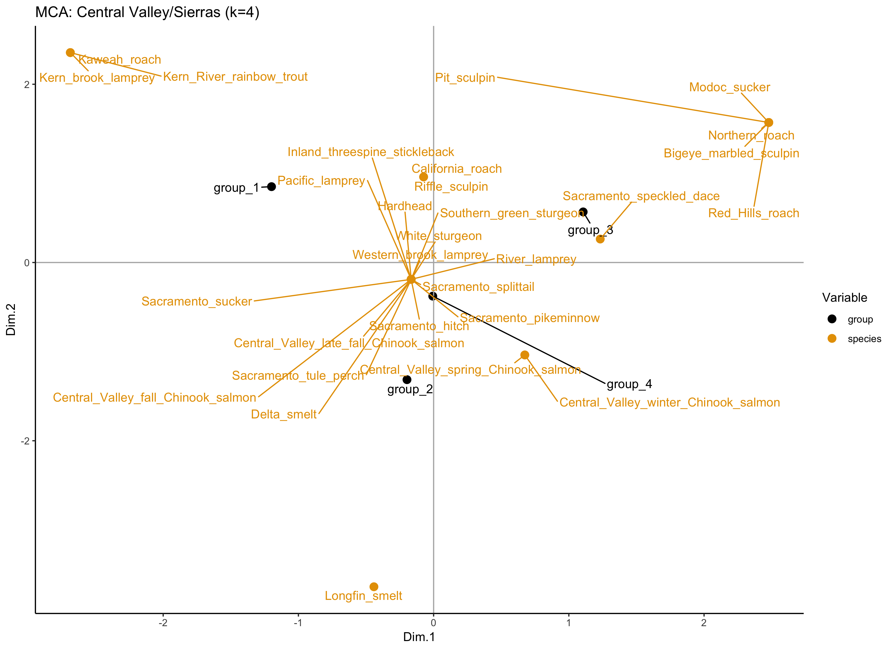

```{r setup, include=FALSE}
knitr::opts_chunk$set(echo = F)
```

## Assessing Assemblage Dissimilarity

Methods for assessing dissimilarity of categorical or binary data include using distance measures like Jaccard, or using more powerful methods like Multiple Correspondence Analysis (MCA). MCA is to qualitative data, as Principal Component Analysis (PCA) is to quantitative data. 

For our data, these methods help distill the similarity in groupings, and which species may be outliers or rare drivers for a given k-group, and provide ways to compare/select the k-number for a given geographic region (e.g., Central Valley/Sierras).

**Main Steps for Analysis**

Data used here are from the most recent run of region groups using the vertex neighbors option. Tables were manually copied to `csv` and then tidied and transformed for use in distance matrices and MCA.

```{r libraries}
suppressPackageStartupMessages({
  library(FactoMineR);
  library(tidyverse);
  library(ggthemes);
  library(ggrepel);
  library(vegan);
  library(here);
  library(DT)
})
```

### Central Valley/Sierras (k=4)

 - First we need to read in the data.

```{r getdata, eval=T, echo=T}

cv_k4 <- read.csv(here("data/central_valley_k4.csv"))

#knitr::kable(cv_k4)
```

 - Then we transform/reshape the data
 
```{r reshape, echo=T}

# try transforming:
cv_k4_long <- gather(cv_k4, key = "group", value = "species") %>% 
  filter(!is.na(species), !species=="")

# view number of categories per group
(cats = apply(cv_k4_long, 2, function(x) nlevels(as.factor(x))))

datatable(cv_k4_long %>% group_by(species) %>% tally %>% rename(n_groups=n) %>% as.data.frame())
```

#### MCA

MCA plot of variables using R package `FactoMineR`.

```{r mca, echo=T, eval=F}

# apply MCA
mca1 = MCA(cv_k4_long, graph = F)

# table of eigenvalues
# mca1$eig

# data frame with variable coordinates
mca1_vars_df = data.frame(mca1$var$coord, Variable = rep(names(cats), cats))

# add species column with rownames
mca1_vars_df$species <- row.names(mca1_vars_df)

# data frame with observation coordinates
#mca1_obs_df = data.frame(mca1$ind$coord)

# plot of variable categories
ggplot(data=mca1_vars_df, 
       aes(x = Dim.1, y = Dim.2)) +
  geom_point(aes(color=Variable), size=3) +
  geom_hline(yintercept = 0, color = "gray70") +
  geom_vline(xintercept = 0, color = "gray70") +
  geom_text_repel(aes(color=Variable, label=species), show.legend = F) +
  scale_colour_colorblind()+ theme_classic()+
  ggtitle("MCA: Central Valley/Sierras (k=4)")

#ggsave(filename = "figs/MCA_plot_cv_k4.png", width = 11, height = 8, units = "in", dpi=300)

```



<!-- #### Jaccard Distance & NMDS -->

<!-- This basically gives the same answer, it just doesn't look as nice. -->

<!-- ```{r jaccard} -->

<!-- # make a 1/0 matrix  -->
<!-- cv_k4_mat <- cv_k4_long %>%  -->
<!--   mutate(g1=if_else(group=="group_1", 1, 0), -->
<!--          g2=if_else(group=="group_2", 1, 0), -->
<!--          g3=if_else(group=="group_3", 1, 0), -->
<!--          g4=if_else(group=="group_4", 1, 0)) %>%  -->
<!--   select(-group) %>% group_by(species) %>%  -->
<!--   summarize_all(sum) %>%  -->
<!--   mutate(species=as.factor(species)) %>% as.data.frame() -->

<!-- cats = apply(cv_k4_mat, 2, function(x) nlevels(as.factor(x))) -->

<!-- # use jaccard for 1/0 (presence absence) -->
<!-- cv4.mat<-as.matrix(cv_k4_mat[,2:5]) -->
<!-- rownames(cv4.mat) <- cv_k4_mat$species -->
<!-- cv4.dist<-vegdist(cv4.mat, method = "jaccard") -->

<!-- # plot a heirarchical clustering of the dissimilarity matrix (need to zoom on this plot to make it legible) -->
<!-- #plot(hclust(cv4.dist), labels = cv_k4_mat$species, cex=0.7) -->

<!-- # NMDS -->
<!-- cv4_nmds <- metaMDS(cv4.mat, distance = "jaccard", autotransform = FALSE, labels=rownames(mca1_vars_df)) -->
<!-- plot(cv4_nmds, display = "sites", type = "t") -->
<!-- #points(cv4_nmds, "species", bg="maroon", pch=21) -->
<!-- text(cv4_nmds, "species", type="t", col="maroon") -->

<!-- ``` -->


### North Coast (k=5)

 - First we need to read in the data.

```{r getdata_nc5, eval=T}

nc_k5 <- read.csv(here("data/ncoast_k5.csv"))

```

 - Then we transform/reshape the data
 
```{r reshape_ncoast5}

# try transforming:
nc_k5_long <- gather(nc_k5, key = "group", value = "species") %>% 
  filter(!is.na(species), !species=="")

# view number of categories per group
(cats = apply(nc_k5_long, 2, function(x) nlevels(as.factor(x))))

datatable(nc_k5_long %>% group_by(species) %>% tally %>% rename(n_groups=n) %>% as.data.frame())

```

#### MCA North Coast (k=5)

```{r mca_ncoast5, eval=F}

# apply MCA
mca1 = MCA(nc_k5_long, graph = F)

# table of eigenvalues
# mca1$eig

# data frame with variable coordinates
mca1_vars_df = data.frame(mca1$var$coord, Variable = rep(names(cats), cats))

# add species column with rownames
mca1_vars_df$species <- row.names(mca1_vars_df)

# plot of variable categories
ggplot(data=mca1_vars_df, 
       aes(x = Dim.1, y = Dim.2)) +
  geom_point(aes(color=Variable), size=3) +
  geom_hline(yintercept = 0, color = "gray70") +
  geom_vline(xintercept = 0, color = "gray70") +
  geom_text_repel(aes(color=Variable, label=species), show.legend = F) +
  scale_colour_colorblind()+ theme_classic()+
  ggtitle("MCA: North Coast (k=5)")

#ggsave(filename = "figs/MCA_plot_nc_k5.png", width = 11, height = 8, units = "in", dpi=300)

```


### North Coast (k=6)

 - First we need to read in the data.

```{r getdata_nc6, eval=T}

nc_k6 <- read.csv(here("data/ncoast_k6.csv"))

```

 - Then we transform/reshape the data
 
```{r reshape_ncoast6}

# try transforming:
nc_k6_long <- gather(nc_k6, key = "group", value = "species") %>% 
  filter(!is.na(species), !species=="")

# view number of categories per group
(cats = apply(nc_k6_long, 2, function(x) nlevels(as.factor(x))))

datatable(nc_k6_long %>% group_by(species) %>% tally %>% rename(n_groups=n) %>% as.data.frame())
```

#### MCA North Coast (k=6)

```{r mca_ncoast6, eval=F}

# apply MCA
mca1 = MCA(nc_k6_long, graph = F)

# table of eigenvalues
# mca1$eig

# data frame with variable coordinates
mca1_vars_df = data.frame(mca1$var$coord, Variable = rep(names(cats), cats))

# add species column with rownames
mca1_vars_df$species <- row.names(mca1_vars_df)

# plot of variable categories
ggplot(data=mca1_vars_df, 
       aes(x = Dim.1, y = Dim.2)) +
  geom_point(aes(color=Variable), size=3) +
  geom_hline(yintercept = 0, color = "gray70") +
  geom_vline(xintercept = 0, color = "gray70") +
  geom_text_repel(aes(color=Variable, label=species), show.legend = F) +
  scale_colour_colorblind()+ theme_classic()+
  ggtitle("MCA: North Coast (k=6)")

#ggsave(filename = "figs/MCA_plot_nc_k6.png", width = 11, height = 8, units = "in", dpi=300)

```


### South Coast (k=5)

 - First we need to read in the data.

```{r getdata_sc5, eval=T}

sc_k5 <- read.csv(here("data/scoast_k5.csv"))

```

 - Then we transform/reshape the data
 
```{r reshape_scoast5}

# try transforming:
sc_k5_long <- gather(sc_k5, key = "group", value = "species") %>% 
  filter(!is.na(species), !species=="")

# view number of categories per group
(cats = apply(sc_k5_long, 2, function(x) nlevels(as.factor(x))))

datatable(sc_k5_long %>% group_by(species) %>% tally %>% rename(n_groups=n) %>% as.data.frame())

```

#### MCA South Coast (k=5)

```{r mca_scoast5, eval=F}

# apply MCA
mca1 = MCA(sc_k5_long, graph = F)

# table of eigenvalues
# mca1$eig

# data frame with variable coordinates
mca1_vars_df = data.frame(mca1$var$coord, Variable = rep(names(cats), cats))

# add species column with rownames
mca1_vars_df$species <- row.names(mca1_vars_df)

# plot of variable categories
ggplot(data=mca1_vars_df, 
       aes(x = Dim.1, y = Dim.2)) +
  geom_point(aes(color=Variable), size=3) +
  geom_hline(yintercept = 0, color = "gray70") +
  geom_vline(xintercept = 0, color = "gray70") +
  geom_text_repel(aes(color=Variable, label=species), show.legend = F) +
  scale_colour_colorblind()+ theme_classic()+
  ggtitle("MCA: South Coast (k=5)")

#ggsave(filename = "figs/MCA_plot_sc_k5.png", width = 11, height = 8, units = "in", dpi=300)

```


### South Coast (k=6)

 - First we need to read in the data.

```{r getdata_sc6, eval=T}

sc_k6 <- read.csv(here("data/scoast_k6.csv"))

```

 - Then we transform/reshape the data
 
```{r reshape_scoast6}

# try transforming:
sc_k6_long <- gather(sc_k6, key = "group", value = "species") %>% 
  filter(!is.na(species), !species=="")

# view number of categories per group
(cats = apply(sc_k6_long, 2, function(x) nlevels(as.factor(x))))

datatable(sc_k6_long %>% group_by(species) %>% tally %>% rename(n_groups=n) %>% as.data.frame())
```

#### MCA South Coast (k=6)

```{r mca_scoast6, eval=F}

# apply MCA
mca1 = MCA(sc_k6_long, graph = F)

# table of eigenvalues
# mca1$eig

# data frame with variable coordinates
mca1_vars_df = data.frame(mca1$var$coord, Variable = rep(names(cats), cats))

# add species column with rownames
mca1_vars_df$species <- row.names(mca1_vars_df)

# plot of variable categories
ggplot(data=mca1_vars_df, 
       aes(x = Dim.1, y = Dim.2)) +
  geom_point(aes(color=Variable), size=3) +
  geom_hline(yintercept = 0, color = "gray70") +
  geom_vline(xintercept = 0, color = "gray70") +
  geom_text_repel(aes(color=Variable, label=species), show.legend = F) +
  scale_colour_colorblind()+ theme_classic()+
  ggtitle("MCA: South Coast (k=6)")

#ggsave(filename = "figs/MCA_plot_sc_k6.png", width = 11, height = 8, units = "in", dpi=300)

```
